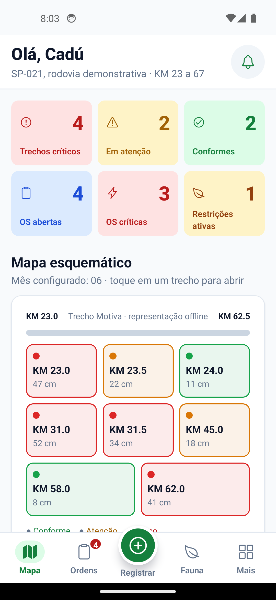
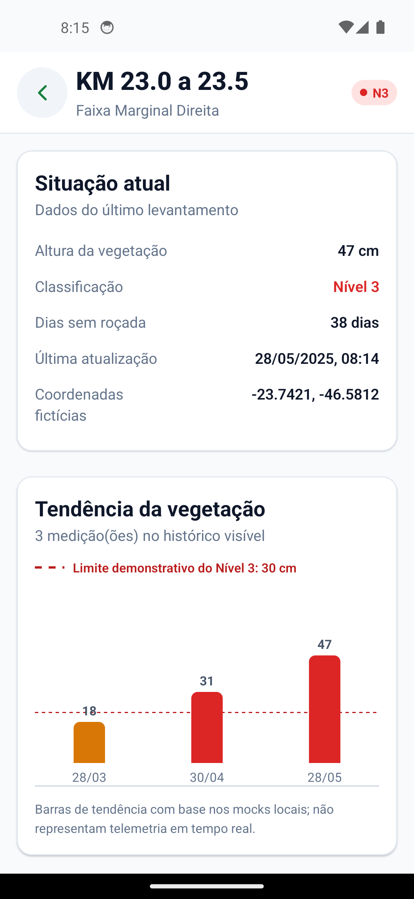
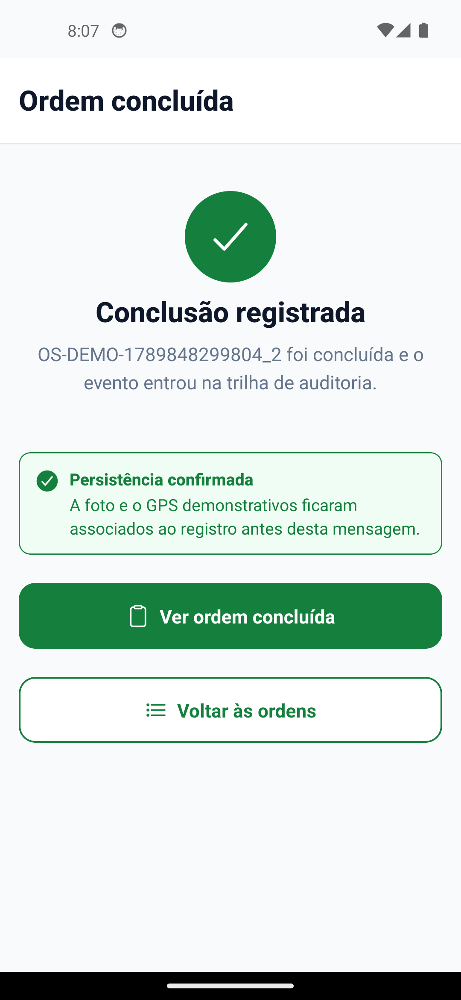

# VegTrack

Aplicativo para acompanhar a vegetação de trechos de rodovia e organizar ordens de serviço. Projeto acadêmico do Challenge Motiva, FIAP.

[Repositório da Sprint 3](https://github.com/RogerioOxy/VegTrack-Sprint3).

## Integrantes

| Nome | RM |
|---|---|
| Rogério Deligi Ferreira Filho | 561942 |
| Maria Fernanda Garavelli Dantas | 562686 |

Identificação da Sprint 3 confirmada pela dupla.

## Proposta e continuidade

O VegTrack foi pensado para o supervisor que precisa decidir quais trechos devem receber uma vistoria ou intervenção. A persona é Carlos, o Cadú: ele acompanha as equipes e precisa consultar o histórico sem depender de planilhas separadas.

Na Sprint 1, o grupo definiu os requisitos e o [protótipo navegável](https://www.figma.com/proto/5oamsogahmd7Se6ZgcjV5S/VegTrack-%E2%80%94-Prot%C3%B3tipo?node-id=2-3&scaling=scale-down&page-id=0%3A1&starting-point-node-id=2%3A3). A [Sprint 2](https://github.com/lucasouza06/Challenge-Sprint02-CPAD) trouxe o mapa esquemático, as ordens, os levantamentos e o calendário de fauna.

Nesta Sprint 3, completamos a implementação dos caminhos de uso, a persistência e os cenários de demonstração. Mantivemos React Native, Expo, TypeScript, React Navigation e Context API para aproveitar a base existente. Não houve migração para Flutter. A base anterior está no commit `6739faf2d18793fb89dd06161c88be8ac3135676`.

Usamos a organização de telas do protótipo e o tema claro, verde e branco da Sprint 2. Os ajustes priorizam leitura, retornos de erro e áreas de toque.

## Executar

O projeto usa Expo SDK 51, React Native 0.74 e React 18. Com Node.js e npm instalados, execute na raiz do repositório:

```sh
npm ci
npm start
```

No Android, use o [Expo Go compatível com o SDK 51](https://expo.dev/go?device=true&platform=android&sdkVersion=51). A versão atual da loja pode não abrir este projeto. Abra primeiro o Expo Go no aparelho ou emulador e aguarde sua tela inicial. Depois abra o projeto pelo QR Code ou endereço exibido no terminal. No emulador, o SDK Android deve estar configurado em `ANDROID_HOME` para usar `npm run android`. Computador e celular precisam acessar o servidor de desenvolvimento.

```sh
npm run web
npm test
npm run typecheck
npm run export:web
```

O navegador é apoio aos testes; não substitui o dispositivo ou emulador exigido no vídeo.

## Acesso de demonstração

| Perfil | E-mail | Senha | Uso |
|---|---|---|---|
| Supervisor | supervisor@vegtrack.demo | vegtrack123 | Consulta, cadastro, execução, configuração e escala de urgência |
| Técnico | tecnico@vegtrack.demo | vegtrack123 | Consulta, levantamentos e execução |
| Gestor | gestor@vegtrack.demo | vegtrack123 | Consulta e exportação |

São contas fictícias. Não use senhas pessoais. O login não consulta servidor nem emite JWT, e a senha não fica no armazenamento local.

## Status por funcionalidade

Os fluxos foram verificados no Android 14 emulado, com testes complementares no navegador. O PDF também foi gerado no Android, salvo e conferido. A demonstração foi gravada com 2min55s; a publicação no YouTube está na etapa final.

| Requisito | Comportamento da Sprint 3 | Situação |
|---|---|---|
| RF001 | Mapa esquemático interativo, filtros e detalhe | Verificado no Android e no navegador |
| RF002 | Levantamento com altura, observação, GPS e anexo simulados | Verificado no Android e no navegador |
| RF003 | Histórico por trecho e tendência das medições | Verificado no Android e no navegador |
| RF004 | Alerta ambiental e bloqueio de intervenção mecanizada no mock | Verificado no Android e no navegador |
| RF005 | Calendário com meses e trechos relacionados | Verificado no Android e no navegador |
| RF006 | Caixa de avisos e entrada simulada em período restrito | Mock verificado no Android; push real pendente |
| RF007 | Criação de OS para medição crítica, sem duplicar OS aberta | Verificado no Android e no navegador |
| RF008 | Filtros por status, método e urgência; início e escala | Verificado no Android e no navegador |
| RF009 | Conclusão com evidência, localização e data | Verificado no Android e no navegador |
| RF010 | Login fictício e permissões por perfil | Mock verificado no Android; autenticação real pendente |
| RF011 | Intervalo gerenciado aplicado às consultas | Verificado no Android e no navegador |
| RF012 | Relatório de ordens concluídas e exportação em PDF | Verificado no Android: PDF salvo com foto e créditos |

Veja [Testes manuais](docs/TESTES-MANUAIS.md) e [validação técnica](docs/VALIDACAO.md). O Android foi testado em emulador; iOS e aparelho físico não foram verificados.

## Telas e relatório

<p>
  
  
  
</p>

[Exemplo de PDF exportado pelo Android](docs/EXEMPLO-RELATORIO.pdf). O arquivo usa dados fictícios e uma foto de exemplo identificada.

## Mocks e limites

Os registros são fictícios, não dados fornecidos pela Motiva. Alturas, prazos, coordenadas, meses de restrição e regras de intervenção são parâmetros de demonstração. Os níveis 1, 2 e 3 não certificam uma norma da ARTESP.

O mapa é esquemático, sem serviço cartográfico. O anexo é uma fotografia real de exemplo, com [autoria e licença documentadas](docs/CREDITOS.md). Ela não foi capturada pelo grupo e não corresponde ao trecho ou às coordenadas simuladas. GPS e câmera reais não são acionados automaticamente. A fauna usa o mês simulado configurado no app para permitir testes reproduzíveis.

Os cenários permitem conferir funcionamento normal, listas vazias, falha com nova tentativa e operação offline. Vazio não apaga a base normal. A fila offline e a sincronização são simuladas, sem envio a uma API.

Os dados ficam no AsyncStorage, que não é criptografado. O app não implementa SSO, integração FastAPI/GBIF, segurança de produção ou auditoria imutável. O histórico local demonstra o fluxo.

## Organização

- `src/screens` e `src/components`: telas e componentes reutilizáveis.
- `src/store` e `src/domain`: estado, persistência e regras dos mocks.
- `src/services`: navegação, evidência e relatórios.
- `src/utils`: dados iniciais e tema.
- `assets`: ícones e fotografia de exemplo licenciada.
- `tests` e `docs`: testes, resultados e roteiro.

## Pendências e plano da Sprint 4

1. Repetir os testes no aparelho da apresentação e validar câmera, GPS e permissões quando conectados aos sensores reais.
2. Substituir os serviços simulados pelos contratos da API, mantendo os estados de carregamento, vazio e erro. Implementar autenticação no servidor e armazenamento seguro dos tokens.
3. Integrar push e testar com o app em segundo plano. A caixa de avisos não substitui essa integração.
4. Validar regras operacionais e ambientais com fontes do projeto antes de substituir os parâmetros fictícios.
5. Tratar conflitos, duplicação de pedidos e proteção dos dados na sincronização real.
6. Planejar atualização do Expo com testes de regressão. Esta entrega mantém o SDK 51 por continuidade com a Sprint 2.

Os problemas encontrados e os ajustes já testados estão no documento de testes manuais. A validação nativa desta Sprint foi concluída. O teste em aparelho físico e a integração real dos sensores continuam no plano da Sprint 4. Build e teste automatizado não substituem a execução manual.

## Demonstração e entrega

Veja [Roteiro do vídeo](docs/ROTEIRO-VIDEO.md). A gravação da Sprint 3 está concluída (2min55s), com legendas e imagens reais do emulador Android. O link não listado será incluído após a publicação. O vídeo da Sprint 2 não comprova esta versão.

O envio formal contém apenas um TXT com integrantes confirmados, repositório atualizado e vídeo da Sprint 3.
